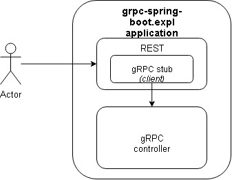

# grpc-spring-boot-expl

## Intro
Small [gRPC](https://grpc.io) + [Spring Boot 2.x.x](https://spring.io/projects/spring-boot) Java project to illustrate a basic implementation and usage 
of [gRPC Java service](https://grpc.io/docs/quickstart/java/).

## Fwks., Tools and Versions
- Java 1.8
- Spring Boot 2.1.5.RELEASE
- gRPC 1.23.0
- gRPC Spring Boot Starter 3.3.0
- [Protocol Buffers](https://developers.google.com/protocol-buffers/) Maven plugin 0.6.1
- [Lombok](https://projectlombok.org/) 1.18.1
- [AssertJ](https://joel-costigliola.github.io/assertj/) 3.13.2
- [Pragmatists/JUnitParams](https://github.com/Pragmatists/JUnitParams) 1.1.1

## References
- [Introduction to gRPC](https://www.baeldung.com/grpc-introduction)
- [The Java gRPC implementation. HTTP/2 based RPC](https://github.com/grpc/grpc-java)
- [gRPC Java Quick Start](https://grpc.io/docs/quickstart/java/)
- [gRPC Java Example](https://codenotfound.com/grpc-java-example.html)
- [Build real-world microservices with gRPC](https://thenewstack.io/build-real-world-microservices-with-grpc/)
- [protobuf](https://github.com/protocolbuffers/protobuf/blob/master/cmake/README.md)
- [Spring Boot starter module for gRPC framework](https://github.com/LogNet/grpc-spring-boot-starter)

## Proposed example diagram

  